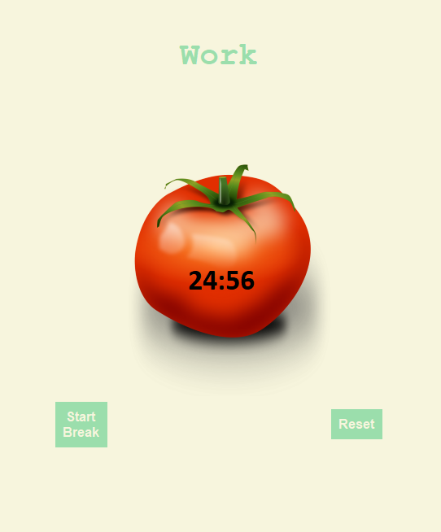

# Pomodoro_Timer-Python
 Basic Pomodoro timer created in Python
## Features:
1. 4 - 25 minute timers followed by 5 minute of break and a long break.
2. Skip timer if you are finished early.
3. Indicator to show number of Work sessions finished.
4. Reset button.

